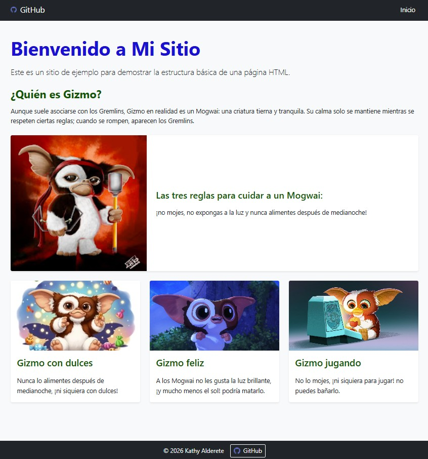
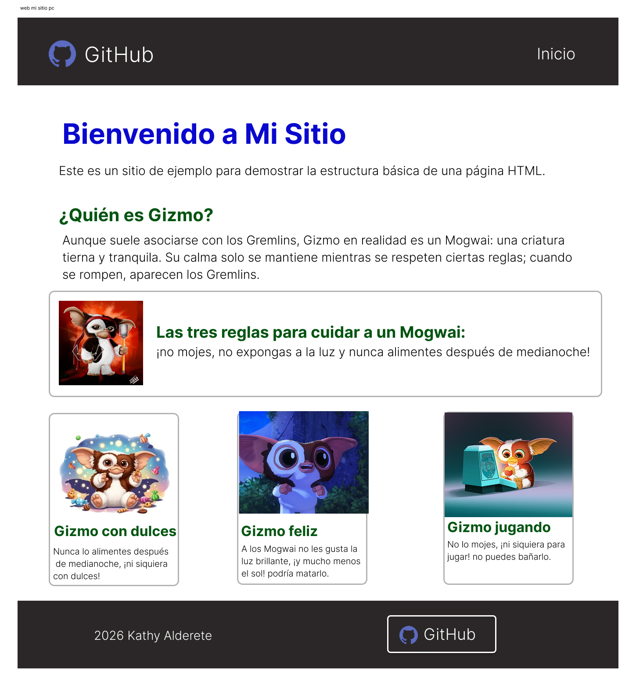
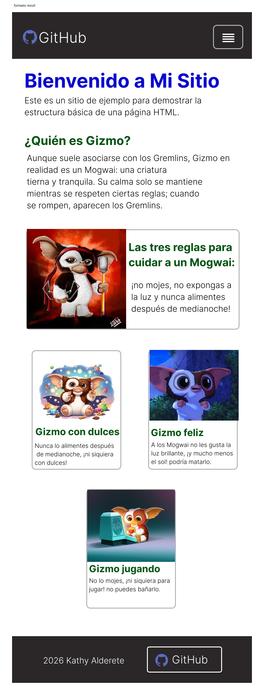

**_<h1 align="center">:vulcan_salute: Mi Sitio | Gizmo como protagonista :computer:</h1>_**

<p align="center">
  Página web estática desarrollada como ejercicio práctico de HTML, CSS y Bootstrap.
</p>

<p align="center">
  <a href="https://kathyalde21.github.io/mi_sitio_uxui/">Ver página web del proyecto</a>
</p>

<!-- --------------------------------------------------------- -->

**<h3>📌 Descripción</h3>**

<p>Este proyecto corresponde a un sitio web de ejemplo creado para practicar la estructura básica de una página HTML, apoyándome en estilos personalizados y componentes de Bootstrap.</p>

<p>Para darle una identidad más visual al ejercicio, usé a <b>Gizmo</b> como protagonista. Además de presentar una página simple y responsive, el contenido incorpora una breve explicación sobre qué es un <b>Mogwai</b> y cuáles son las tres reglas principales asociadas a su cuidado.</p>

<!-- --------------------------------------------------------- -->

**<h3>✨ ¿Qué muestra este sitio?</h3>**

- Una estructura HTML base con navegación, contenido principal y pie de página.
- Uso de **Bootstrap 5** para apoyar la maquetación.
- Estilos personalizados en CSS para jerarquía visual y ajuste de imágenes.
- Distribución responsive para adaptarse a pantallas grandes y móviles.
- Una temática visual centrada en **Gizmo**, utilizada como recurso para hacer más atractivo el ejercicio.

<!-- --------------------------------------------------------- -->

**<h3>🛠 Tecnologías utilizadas</h3>**

<p>
  
  
  
</p>

<!-- --------------------------------------------------------- -->

**<h3>📷 Vista previa</h3>**

<p align="center">
  
</p>

<!-- --------------------------------------------------------- -->

**<h3>🎨 Adaptación visual en Figma</h3>**

<p>
Como complemento del desarrollo en <strong>HTML, CSS y Bootstrap</strong>, realicé una adaptación visual en <strong>Figma</strong> tomando como base la estructura ya construida del sitio.
Este paso me permitió documentar la propuesta y contrastar su presentación en <strong>versión escritorio</strong> y <strong>versión móvil</strong>.
</p>

<table align="center">
  <tr>
    <td align="center">
      
      <br>
      <sub><strong>Versión escritorio</strong></sub>
    </td>
    <td align="center">
      
      <br>
      <sub><strong>Versión móvil</strong></sub>
    </td>
  </tr>
</table>

<!-- --------------------------------------------------------- -->

**<h3>📚 Lo que practiqué en este ejercicio</h3>**

- Estructura semántica básica en HTML.
- Integración de Bootstrap mediante CDN.
- Personalización visual con CSS externo.
- Uniformidad visual en imágenes usando `object-fit`.
- Ajustes responsive para distintos tamaños de pantalla.
- Organización clara del contenido en secciones y cards.
- Documentación visual del diseño en Figma para contrastar la versión desktop y mobile.

<!-- --------------------------------------------------------- -->

**<h3>📁 Estructura del Proyecto:</h3>**

```bash
📁 mi_sitio
├── 🟧 index.html
├── 📘 README.md
└── 📁 assets
    ├── 📁 css
    │   └── 🟦 style.css
    └── 📁 img
        ├── 🖼️ gizmo.jpg
        ├── 🖼️ github.png
        ├── 🖼️ vista_del_sitio.jpg
        ├── 📁 readme
        │   ├── 🖼️ web_mi_sitio_pc.jpg
        │   └── 🖼️ formato_movil.jpg
        └── 📁 gizmo
            ├── 🖼️ gizmo_dulces.jpg
            ├── 🖼️ gizmo_feliz.webp
            └── 🖼️ gizmo_jugando.jpg
```